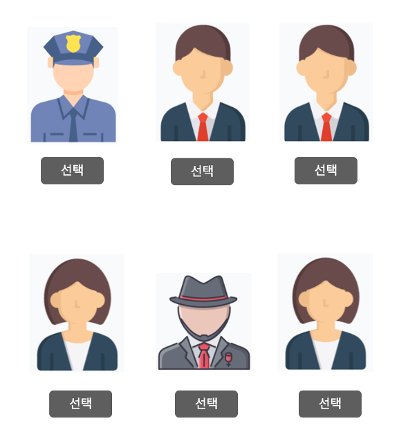

# computer network
* 2020.03 ~ 2020.07
* 
---

### 프로젝트 소개

##### Django를 이용한 웹 기반 **마피아 게임** 구현
* 마피아 게임이란?
    * 시민들 사이에 섞여 있는 마피아를 게임 참가자들끼리 토론하여 추론하는 게임입니다. 
    * 토론 후 사람을 지목하여 제일 많은 지목을 받은 사람은 직업이 공개 되고 죽게 됩니다.
    * 시민의 승리 조건은 마피아를 모두 잡는 것이고, 마피아의 승리 조건은 시민보다 마피아의 수가 많을 경우 입니다.
* 

---

### 기능

1. 로그인
* 이름을 적고 로그인할 수 있다.
* 들어온 순서대로 랜덤으로 직업이 정해진다 (마피아1, 시민4)

* 

2. 대기 화면
* 한 명이 들어올때마다 이름과 이미지가 생성되면서 입장을 알 수 있다.
* 5명이 들어오면 5초후 게임이 바로 시작된다.

* 

3. 게임 진행
* 유저들은 3분간 채팅을 통해 대화한다.
* 3분 후, 마피아를 투표한다.

* 

4. 게임 결과
* 투표 결과 마피아가 많은 표를 받은 경우, 시민 승
* 시민이 죽은 경우, 게임을 반복한다.
* 시민과 마피아가 한 명씩 남은 경우 마피아 승리로 끝이난다.

